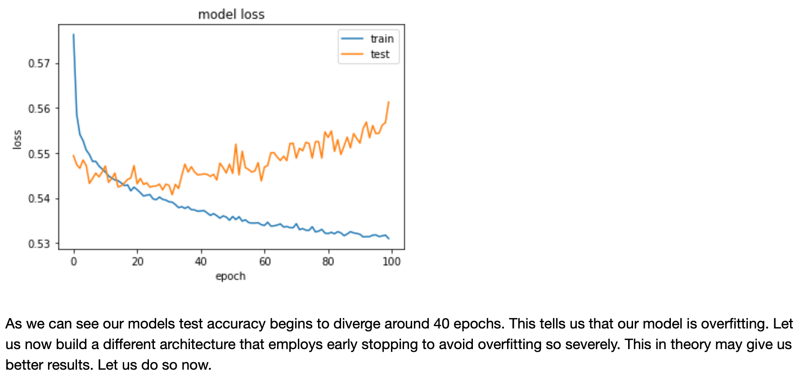
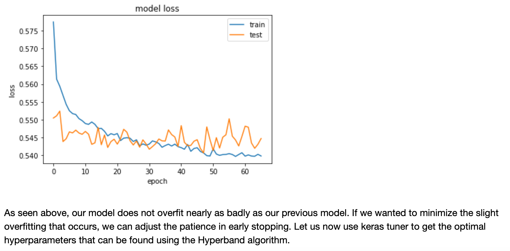

# Deep Learning Challenge

## Overview
The purpose of this analysis is to aid Alphabet Soup in having a successful turnout for selected applicants for funding their ventures. The application of a neural network in this dataset was used to hyper tune the model to find its optimal hyperparameters needed to produce the best performance.

From Alphabet Soup’s business team, the data contains more than 34,000 organizations that have received funding from Alphabet Soup over the years. Within this dataset are a number of columns that capture metadata about each organization, such as:

+ **EIN** and **NAME** —Identification columns
+ **APPLICATION_TYPE** —Alphabet Soup application type
+ **AFFILIATION** —Affiliated sector of industry
+ **CLASSIFICATION** —Government organization classification
+ **USE_CASE** —Use case for funding
+ **ORGANIZATION** —Organization type
+ **STATUS** —Active status
+ **INCOME_AMT** —Income classification
+ **SPECIAL_CONSIDERATIONS** —Special considerations for application
+ **ASK_AMT** —Funding amount requested
+ **IS_SUCCESSFUL** —Was the money used effectively
 

## Results
### Data Preprocessing
+ Target variable (predictand) **IS_SUCCESSFUL**
+ Features used were all but target
+ Dropped features include **EIN** & **NAME**

#### Initial Model Loss

#### Optimal Model Loss

## NN Architecture
There are three hidden layers, the number of neurons in total add up to eighty in total. The activation function that was found to be optimal was relu. I developed three different neural network architectures that topped off at 73% accuracy. The best model incorporated keras tuner and found the optimal hyperparameters possible. The initial neural network had two hidden layers with 150 total neurons. This model had signs of overfitting. The second NN architecture had three hidden layers with a total of 175 neurons. This model did better but since we incorporated by early stopping along with dropout regularization with 20% of neurons that are least significant in the final output had been dropped. Finally, the keras tuner produced the optimal results.

## Summary
The optimal neural network produced 74% accuracy, with a loss of 0.54 test loss. This final model showed great promise with for Alphabet to predict if an individual will have a successful turnout in funding their venture.A different model simpler model that could solve this model and perform very similar or perhaps better would be SVM or support vector machine. This machine learning model does not require a neural network and thus is light weight to run even large amounts of data on. For the future work, performing features selection would be beneficial in selecting the highly correlated features to train or model on and also to avoid noisy features that either drop our models performance or are not at all helpful.  

## References
IRS. Tax Exempt Organization Search Bulk Data Downloads. [https://www.irs.gov/charities-non-profits/tax-exempt-organization-search-bulk-data-downloads]
